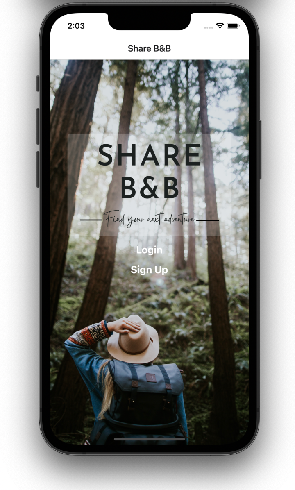
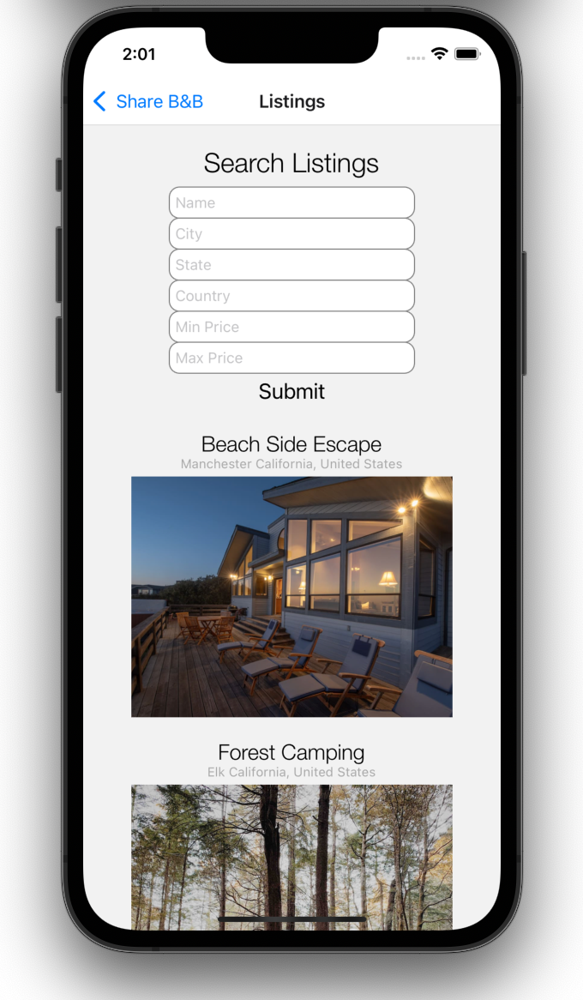

# Share B&B 
An application to help users find private outdoors spaces to rent that is built using:
- React Native
- Express

# Project Screen Shots

# Installation Instructions

## To Install:
Use the command: `npm install`  

## To Start the Server:
Use the command: `npm start`  

## To Visit the App in Development Mode:
In the Expo Browser Developer Tool, click: `Run iOS simulator`  

The page will reload if you make edits.\
You will also see any errors in the Expo Developer console.

